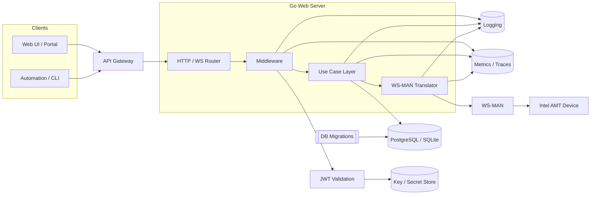
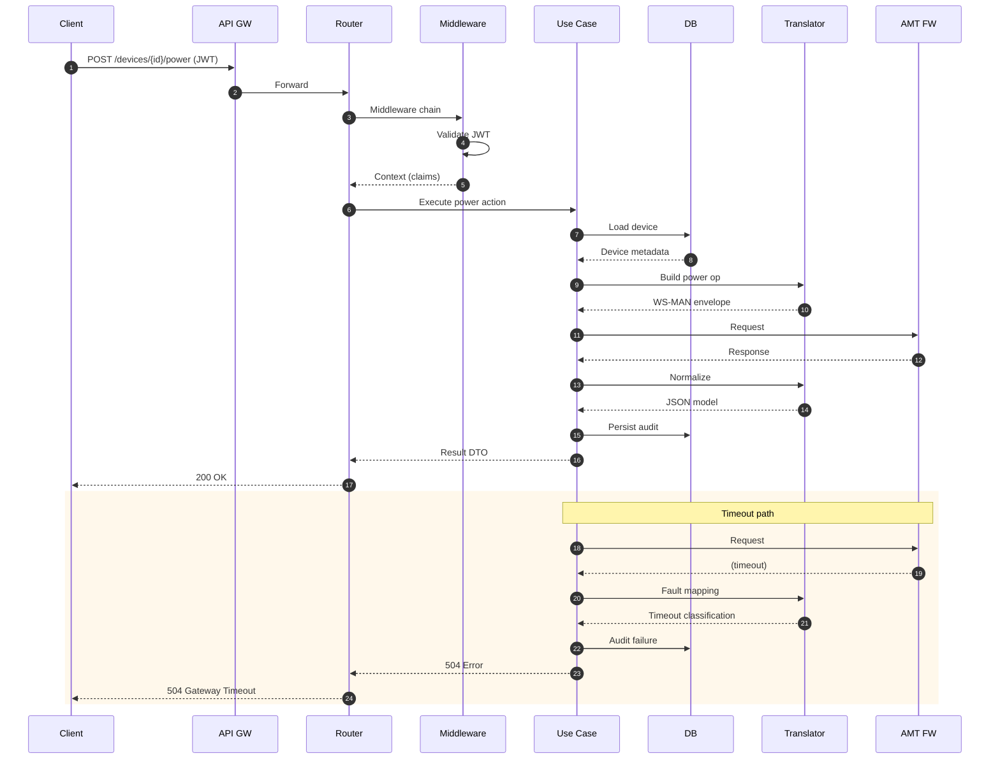
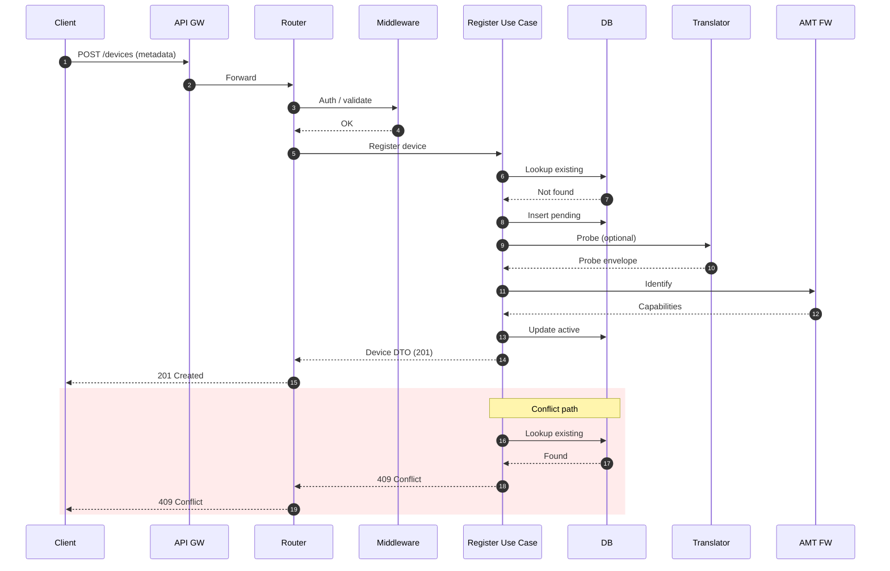
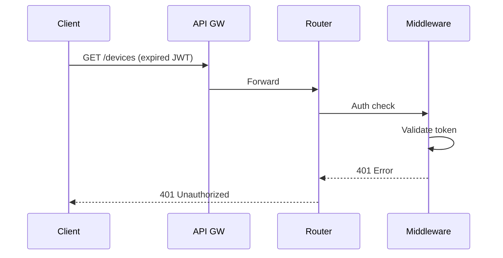

## 1. Overview
The **Console** service provides secure remote management capabilities for Intel® AMT-enabled devices via a Go-based backend. It exposes REST APIs (and select WebSocket endpoints) abstracting Intel AMT WS-MAN operations (power control, inventory, configuration, KVM enablement). The service integrates with a persistence layer (SQLite for local development, PostgreSQL for production) and implements JWT-based authentication, structured logging, and auditable operation tracking.

Core responsibilities:
- Device registry & operational state management
- Session / tunnel establishment logic (preconditions for WS-MAN reachability)
- Translation of REST-level operations -> WS-MAN messages
- Observability (logging, metrics, tracing) & audit event persistence
- Security: JWT validation, key handling, input validation, error normalization

## 2. Architecture Diagram

## 3. Component Roles
### 3.1 API Gateway (Optional)
Ingress layer offering TLS termination, rate limiting, routing, and progressive delivery controls. Absent in minimal deployments.

### 3.2 Go Web Server
Implements transport concerns (HTTP/REST & WebSocket), routing, middleware (auth, logging, validation), graceful shutdown, health endpoints, and request correlation.

### 3.3 Use Case Layer
Encapsulates application orchestration (device registration, profile lifecycle, power operations) to decouple handlers from persistence & WS-MAN protocol details.

### 3.4 Persistence
SQLite for local development; PostgreSQL in production. Stores device metadata, domain constructs (profiles, TLS, wireless configs), and audit events. Managed via migration scripts.

### 3.5 Authentication & Key Handling
JWT validation middleware (claims, signature, expiry) plus on-disk key storage for local encryption artifacts. Supports future external KMS integration.

### 3.6 WS-MAN Translator
Abstracts SOAP/WS-MAN envelope creation, timeout/retry policy (idempotent ops), response normalization, error mapping (fault -> HTTP taxonomy), and metrics emission.

### 3.7 Observability
Central structured logging, metrics (latency, success/error ratios), tracing spans (API -> translator -> device), and auditable events for compliance.

### 3.8 Error Strategy
Unified error wrapping and classification (input validation 400, auth 401/403, not found 404, conflict 409, internal 500, upstream timeout 504). Sanitized messages returned to clients.

### 3.9 Extensibility
Pluggable translator, alternative persistence implementations, future asynchronous dispatch queue, gRPC façade, or policy/authorization engines.

## 4. Key Workflows
### 4.1 Device Power Action (Narrative)
1. Client issues `POST /devices/{id}/power` with JWT.
2. Gateway (optional) applies rate limiting & forwards.
3. Router invokes middleware (auth, correlation, validation).
4. Use case retrieves device & determines WS-MAN operation.
5. Translator builds and sends WS-MAN envelope.
6. Firmware response normalized to domain model / DTO.
7. Audit persisted; success (200) returned or timeout (504) on SLA breach.

### 4.2 Device Registration
- Validates payload, checks existing device, inserts pending record, optional WS-MAN probe for capabilities, updates state to active, returns 201 or 409 on duplicate.

### 4.3 Authentication Failure
- Expired or invalid token triggers 401 before domain logic; no persistence or translator invocation.

## 5. Sequence Diagrams
### 5.1 Power Action

### 5.2 Device Registration

### 5.3 Authentication Failure

## 6. REST → WS-MAN Translation
### 6.1 Context & Drivers
REST abstraction hides verbose WS-MAN SOAP XML; central translation improves security, maintainability, and observability.

### 6.2 Decision
Adopt an internal translator component invoked by use cases. It builds envelopes, executes the transport, parses results/faults, applies retry (idempotent only), and emits metrics/events.

### 6.3 Rationale
- Isolation from firmware schema changes
- Unified error taxonomy & logging
- Faster feature enablement via descriptor-driven approach

### 6.4 Alternatives Considered
| Alternative | Drawbacks |
|------------|-----------|
| Direct WS-MAN exposure | High complexity, poor ergonomics, security risk |
| Immediate gRPC replacement | Increases early adoption friction |
| Full async job queue | Adds latency + infra overhead for interactive ops |
| Per-command bespoke logic | Duplication and inconsistent error handling |

### 6.5 Consequences
Positive: Simplified client integration, structured observability, easier testing (mock translator).
Negative: Translator hotspot risk, schema drift tracking burden, abstraction may obscure low-level debugging.

### 6.6 Implementation Notes
- Descriptor structs (e.g., `PowerAction`, `InventoryRequest`) drive envelope templates.
- Interface: `Execute(ctx, op) (Result, error)` with rich error types.
- Central constants for namespaces/action URIs.
- Pooled buffers to reduce GC churn at scale.
- Fault parser returns canonical codes (`ErrTimeout`, `ErrAuth`, `ErrSchema`).

### 6.7 Security Considerations
Strict pre-validation; no raw envelopes persisted; token enforcement (exp/aud/iss/nbf), redacted logging, optional debug mode gated by role.

### 6.8 Observability
Suggested metrics: duration histogram, total success/error counters, timeout/fault counters. Tracing spans per WS-MAN invocation with device & operation attributes. Structured logs (`traceId`, `deviceId`, `operation`, latency, outcome).

### 6.9 Future Evolution
Adaptive retry logic, schema drift detection, optional async dispatch path, CLI replay tooling.

## 7. Failure & Recovery Scenarios
| Scenario | Mitigation |
|----------|-----------|
| Device unreachable | Timeout → 504 with retry guidance |
| WS-MAN schema drift | Central template update + contract tests |
| Migration failure | Fail-fast + rollback guidance |
| Key corruption | Regenerate & alert |
| Latency spike | Autoscale + adaptive timeouts (future) |

## 8. Assumptions & Constraints
- Short-lived JWT tokens; refresh external.
- Devices reachable via network path supporting WS-MAN.
- PostgreSQL selected for relational integrity; SQLite local only.
- Raw WS-MAN not returned to clients (except gated debug).

## 9. Open Questions
- Introduce streaming telemetry & KVM over WebSocket?
- Add OPA / policy engine for fine-grained auth?
- Async queue for long-running provisioning actions?
- Formal OTEL adoption timeline?

## 10. Summary
This merged architecture & design consolidates structural, behavioral, and decision records for the Console service. A layered approach (ingress → routing/middleware → use cases → translator → firmware) maximizes separation of concerns, while the translator pattern isolates protocol complexity, enabling secure, observable, and evolvable remote management of Intel AMT devices.

---
